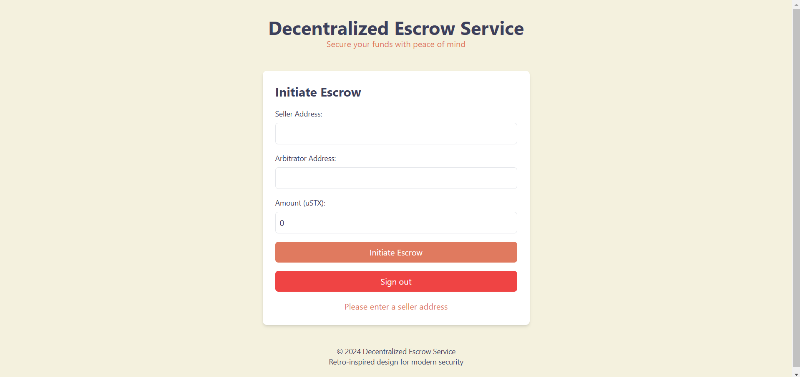

# Decentralized Escrow Service



This project implements a **Decentralized Escrow Service** using **Clarinet** and **Clarity**. The smart contract facilitates secure transactions between two parties (buyer and seller) by locking funds in escrow. It includes key features like dispute handling through an arbitrator and automatic fund release upon confirmation of delivery.

## Features
- Funds are locked in escrow until conditions are met.
- Dispute resolution mechanism involving a trusted arbitrator.
- Refund mechanism in case of non-performance.
- Use cases: freelance jobs, real estate transactions, marketplace payments..

---

## Contract Overview

### State Variables
- **buyer**: The address of the buyer.
- **seller**: The address of the seller.
- **arbitrator**: The address of the arbitrator.
- **amount**: The escrow amount (in STX).
- **is-complete**: A boolean indicating if the transaction is complete.
- **is-disputed**: A boolean indicating if a dispute has been raised.

---

### Public Functions

#### `initiate-escrow`
```clarity
(define-public (initiate-escrow (seller-principal principal) (arbitrator-principal principal) (escrow-amount uint))
```
- **Description**: Buyer initiates the escrow by locking funds.
- **Parameters**: 
  - `seller-principal`: The address of the seller.
  - `arbitrator-principal`: The address of the arbitrator.
  - `escrow-amount`: The amount to be locked in escrow.
- **Returns**: `true` on success, or an error code.

#### `confirm-delivery`
```clarity
(define-public (confirm-delivery)
```
- **Description**: Seller confirms the delivery, releasing funds to the seller.
- **Returns**: `true` on success, or an error code.

#### `raise-dispute`
```clarity
(define-public (raise-dispute)
```
- **Description**: Buyer raises a dispute involving the arbitrator.
- **Returns**: `true` on success, or an error code.

#### `resolve-dispute`
```clarity
(define-public (resolve-dispute (refund-buyer bool))
```
- **Description**: Arbitrator resolves the dispute by either refunding the buyer or paying the seller.
- **Parameters**: 
  - `refund-buyer`: A boolean indicating whether to refund the buyer.
- **Returns**: `true` on success, or an error code.

---

## Testing with Vitest

The tests are written using **Vitest** to ensure all functions work as expected. The `mockContract` object simulates the contract interactions during testing.

### Test Cases

1. **Initiating Escrow**: Ensures the buyer can successfully initiate the escrow.
2. **Confirm Delivery**: Verifies that the seller can confirm delivery.
3. **Raise Dispute**: Checks if the buyer can raise a dispute.
4. **Resolve Dispute**: Confirms the arbitrator can resolve disputes in favor of the buyer or seller.

---

### Sample Test Code
```typescript
import { describe, it, beforeEach, expect } from 'vitest';

// Mock contract for testing
const mockContract = { ... };

describe('Escrow Service', () => {
  // Test cases here...
});
```

---

## How to Run the Tests

1. Ensure you have **Node.js** and **Vitest** installed.
2. Clone the repository and navigate into the project folder.
3. Run the following command to execute the tests:
   ```bash
   npm test
   ```

---

## Error Codes

| Code | Description                       |
|------|-----------------------------------|
| 100  | Only the buyer can initiate.      |
| 101  | Insufficient STX balance.         |
| 102  | Only the seller can confirm.      |
| 103  | Cannot confirm if disputed.       |
| 104  | Only the buyer can raise disputes.|
| 105  | Only the arbitrator can resolve.  |
| 106  | Escrow amount must be > 0.        |
| 107  | Seller and buyer cannot be the same. |
| 108  | Arbitrator cannot be the same as buyer. |
| 109  | Seller and arbitrator cannot be the same. |

---

## Usage

This decentralized escrow service can be used for:
- **Freelance jobs**: Holding payments until project completion.
- **Real estate transactions**: Securing funds until property delivery.
- **Marketplace payments**: Ensuring product delivery before releasing payment.

---

## License

This project is licensed under the MIT License.

---

